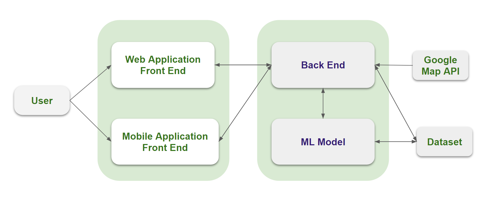
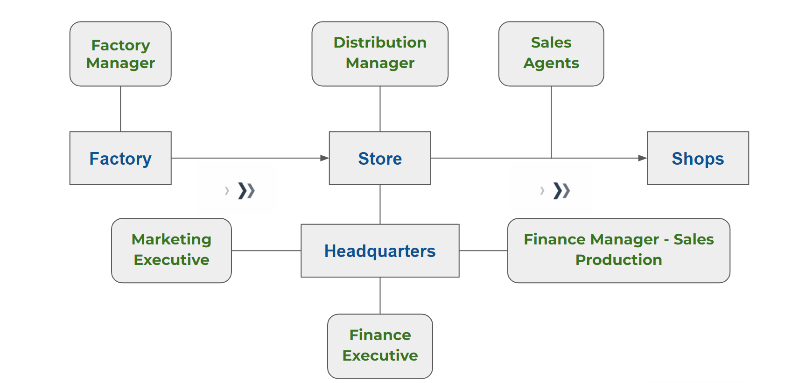

# Automated Computerized System for a startup Manufacturing and Distribution Company

## Table of Contents
- [Overview](#overview)
- [Problem domain](#problem-domain)
- [Our Solution](#our-solution)
- [Solution Architecture](#solution-architecture)
- [User Story](#user-story)
- [Our Approach](#our-approach)
- [Links](#product-owners)

## Overview

This project is proposed to develop an automated system for Victa Towers (Pvt) Ltd to improve
efficiency of production and distribution of company’s production. A computerized web based system
together with mobile app is required to be developed with features including database to feed
production & delivery from factory to the stores and from stores to market place or end-customer,
tracking all delivery process with mapping, and tracking sales and finance.

## Objectives

 To develop an automated computerized system for Victa Towers (Pvt) Ltd for the automation of
distribution process
 To increase efficiency and tracking of production and distribution of products
 To improve security of the company operations
 
## Problem domain 

- Victa Towers is a startup Manufacturing company working in chemical and herbal products such as washing powder,Cleaning solutions,tea etc.
- They are a large scale distribution company with  small number of employees.
- They want to Automate their manufacturing and distribution process without increasing lot of employees.  
- Other than that they are in need of a method to predict the future manufacturing demands and sales.  

## Motivation 
 
- To reduce the problems that the company has 
- To Reduce the paperwork and documentation in the process of delivering and manufacturing
- To reduce the problems with corruption and security 
- To reduce Excessive or insufficient production
- To reduce inefficient working processes

## Our Solution 

- A computerized web based system together with mobile app.
- Including database to feed production & delivery.  
- Tracking all delivery process with mapping.
- Tracking sales and finance.
- Machine learning model to predict future sales

## Solution Architecture 

## User Story

## Proposed UI

## Measuring Matrix 

- Delivery to Receive ratio tracking
- Percentage of product tracking via the map 
- Accuracy in the future predictions
- Comparison of logistic expenses before and after the implementation    

## Our Approach 

- Development of the basic website with CRUD operations 
- Integrating the complex parts like third party APIs 
- Integrating the DM and ML part
- Improvements of Website and ML Model   

## Product Owners 

- Dr. Janaka Alawathugoda, Department of Computer Engineering, University of Peradeniya
- Mr. Neranjan Wijesinghe, Director Board Member (Software Engineer by profession), Victa Towers (Pvt) Ltd
- Dr. Prasanga Mantilaka

## Scrum Master

- Mr.Amila Indika
 
## Project Developers 

- E/17/091 : Mr.Gallage P.G.A.P. [e17091@eng.pdn.ac.lk](mailto:e17091@eng.pdn.ac.lk)
- E/17/144 : Mr.Jayaweera K.P.C.D.B. [e17144@eng.pdn.ac.lk](mailto:e17144@eng.pdn.ac.lk)\]
- E/17/168 : Mr.Kodagoda K.H.S.P. [e17168@eng.pdn.ac.lk](mailto:e17168@eng.pdn.ac.lk)\]
- E/17/405 : Mr.Wijesinghe W.D.L.P. [e17405@eng.pdn.ac.lk](mailto:e17405@eng.pdn.ac.lk)\]
